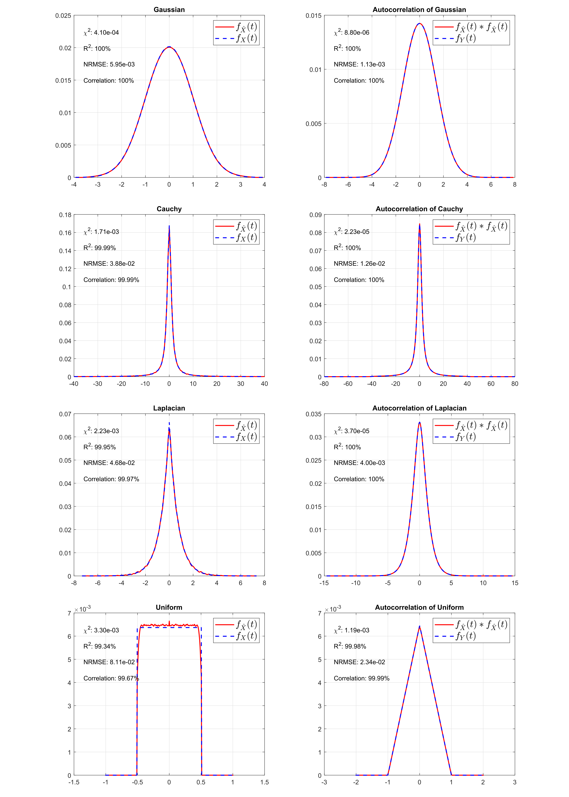

# Noise-Model-Recovery
This repository provides the tool to recover the noise model from dataset, and can also be used to recover the signal from its autocorrelation.

- [Assumptions](#assumptions)
- [Function introduction](#function-introduction)
  - [Deautocorrelation](#deautocorrelation)
  - [Pdf recovery](#pdf-recovery)
  - [Noise model recovery from datasets](#noise-model-recovery-from-datasets)
- [Example results](#example-results)
- [Reference](#reference)

# Assumptions
## For deautocorrelation
* The original pdf/signal is symmetric with respect to some vertical line.
* The signal is real-valued.

## For noise model recovery from real datasets
* The signal is strongly correlated for the same pixel between adjacent time points.
* The noise follows the same distribution and temporally independent.

# Function introduction
## Deautocorrelation
* Recover the original function from its autocorrelation in `deautocorrelation.m`.
* Input: autocorrelation of some function.
* Output: recovered function.

## Pdf recovery
* Y = X1-X2, X1 and X2 are i.i.d.
* Recover the distribution of X from the distribution of Y in `pdf_recover.m`. 
* By autocorrelation, the recovered function may not denote a true pdf, thus need a refine step.
* Input: distribution of Y. (Users can also assign weights for the refine step).
* Output: distribution of X.

## Noise model recovery from datasets
* Recover noise model for datasets in `nmr.m`.
* Input: data.
* Output: distribution of noise, distribution of noise difference (Y), binSize.

# Example results
## Without sampling error and signal residue
Here are the example results for deautocorrelation. 
Some common asymmetric distributions are also tested (No sampling error and no signal residue).

## Simulation noise without signal residue
Here are simulation results, the noise is generated by MATLAB, with 10^8 samples.

## Considering signal residue
Take Gaussian noise as example to see the influence of signal residue.
SNR, signal change rate, and the signal ratio in the whole video will all have impact on the recovered result.
Here we show some results under 10dB, 1/200 signal ratio.

# Reference:
Waiting for the submission.
